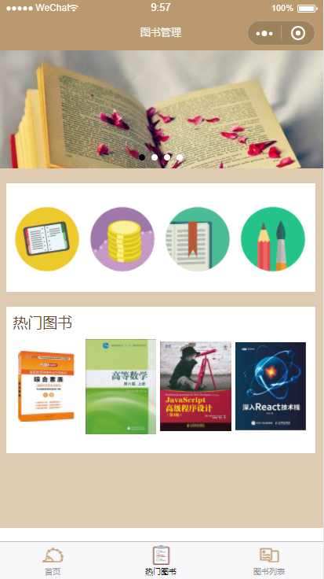
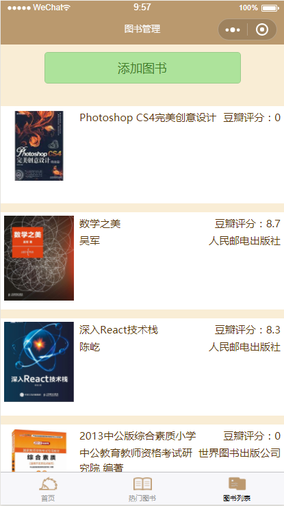
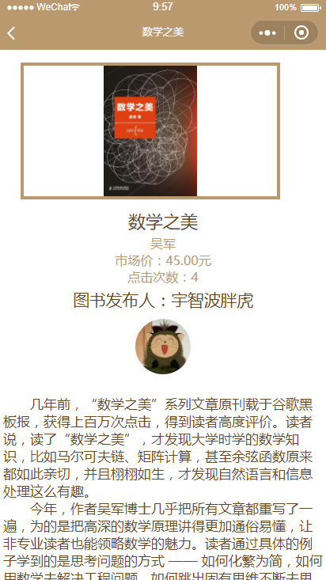

# BookMarket
图书管理小程序


### 项目创建+运行方式
```
	npm install --global vue-cli  //全局安装 vue-cli
	vue init mpvue/mpvue-quickstart BookMarket_mpvue3  //创建项目
	
	cd BookMarket_mpvue3
	npm install
	npm run dev
	
	//因为使用mpvue框架开发小程序，因此运行项目时必须执行npm run dev命令，实时执行生成小程序镜像代码
	
	//注意！！！手机真机运行时，打开调试模式，才能从后台获取到数据
```

### 使用技术
[1、mpvue（小程序开发框架）文档](http://mpvue.com/mpvue/)
    
[2、koa.js(Node.js开发框架)文档](https://koa.bootcss.com/)

[3、Wafer - 快速构建具备弹性能力的微信小程序](https://github.com/tencentyun/wafer)


### 界面简介


  

a.点击按钮，授权登陆..................................................................................................................
  
  

b.热门图书，根据数据库点击次数，从多到少进行排名...................c.点击扫码按钮，扫描图书ISBN码添加图书，下拉刷新看到效果
  
  

d.图书详情：查看图书基本信息和图书发布人


### 腾讯云服务器配置

project.config.json："qcloudRoot": "./server/"

[1、微信小程序开发者工具>常见问题](https://cloud.tencent.com/document/product/619/11442)

[2、腾讯云API密钥管理](https://console.cloud.tencent.com/cam/capi)

[3、腾讯云账号信息](https://console.cloud.tencent.com/developer)


### 项目环境配置

1、退出严格开发模式：build/webpack.base.conf.js，注释module/rules

2、代码规范：
```
"lint": "eslint --fix --ext .js,.vue src"
	
之后执行  npm run lint、npm run dev
	
```

3、项目依赖安装
``` bash
npm install wafer2-client-sdk --save

npm install sass-loader --save-dev

npm install node-sass --save-dev
```

4、src/config：配置可上传至腾讯云
```
project.config.json: "qcloudRoot": "./server/",
```

### 与后台连接数据

1、src/APP.vue：使用url，发起请求
```
	async created () {
		const res = await get('/weapp/demo')
	}
```

2、routes/index.js:ajax 服务路由集合
```
	router.get('/demo', controllers.demo)
```

3、controllers/demo.js：控制层用于与数据库连接，使用koa.js的洋葱圈模型
``` 
	module.exports = async(ctx) =>{
		ctx.state.data = {
			msg:'测试小程序后台是否有用'
		}
	}
```

4、src/config.js
```
/配置项

// 本地
// const host = 'http://localhost:5757'

//开发环境，上传到腾讯云就访问这个url
const host = 'https://bmg41cxh.qcloud.la'
```

5、src/util.js：封装get和post请求，方便调用
```
	export function get (url, data) {
	  return request(url,'GET', data)
	}
	export function post (url, data) {
	  return request(url,'POST', data)
	}
	function request(url,method,data,header={}){
	  return new Promise((resolve, reject) => {
		wx.request({
		  data,
		  method,
		  header,   
		  url: config.host + url, 
		  success: function (res) {
			if (res.data.code === 0) {
			  resolve(res.data.data)
			} else {
			  showModal('失败',res.data.data.msg)
			  reject(res.data)
			}
		  }
		})
	  })
	}
```

6、本地搭建后台环境的话，需要下面的代码，直接部署在腾讯云上，则不需要，注释掉

```
const CONF = {
      // 其他配置 ...
    serverHost: 'localhost',
    tunnelServerUrl: '',
    tunnelSignatureKey: '27fb7d1c161b7ca52d73cce0f1d833f9f5b5ec89',
      // 腾讯云相关配置可以查看云 API 秘钥控制台：https://console.cloud.tencent.com/capi
    qcloudAppId: '您的腾讯云 AppID',
    qcloudSecretId: '您的腾讯云 SecretId',
    qcloudSecretKey: '您的腾讯云 SecretKey',
    wxMessageToken: 'weixinmsgtoken',
    networkTimeout: 30000
}
```

### 小程序技术知识点

1、登录授权

在这一块卡的时间比较久，原本是通过请求腾讯云获取openid，但按照官方文档依旧报参数不正确的错误，因此换了一种登录授权方式。
```
<button class="login_style" open-type="getUserInfo" @getuserinfo="bindGetUserInfo">登录</button>

    bindGetUserInfo (e) {
      this.userInfo = e.target.userInfo
      wx.setStorageSync('userinfo', this.userInfo)
    }
```

3、扫码

调用微信接口，扫描获取图书的ISBN码

```
    scanBook () {
      wx.scanCode({
        success: (res) => {
          if (res.result) {
            this.addBook(res.result)
            // console.log(res.result)
          }
        }
      })
    }
```

4、调用豆瓣接口，获取对应ISBN码的图书信息

```
	let url = 'https://api.douban.com/v2/book/isbn/'+isbn
	const bookinfo = await getJSON(url)
	function getJSON(url){
	  return new Promise((reslove,reject)=>{
		https.get(url,res=>{
		  let urlData = ''
		  res.on('data', data=>{
			urlData += data
		  })
		  res.on('end', data=>{
			const bookinfo = JSON.parse(urlData)
			if(bookinfo.title){
			  reslove(bookinfo)
			}
			reject(bookinfo)
		  })
		})
	  })
	}
```

5、下拉刷新
```
onPullDownRefresh()
onReachBottom()
wx.showNavigationBarLoading()
wx.stopPullDownRefresh()
wx.hideNavigationBarLoading()
```

6、多页面共享数据
```
wx.setStorageSync('userinfo', this.userInfo)

this.userinfo = wx.getStorageSync('userinfo')
```

7、组件化开发，父组件向子组件传递数据
```
import HotBooks from '@/components/HotBooks'

//父组件，数据tops
<HotBooks :tops='tops'></HotBooks>

components: {
   HotBooks
}

data () {
  return{
    tops: []
   }
}

//子组件
<div class="slide" :key='imgindex' v-for='(top,imgindex) in tops'>
        
</div>

export default {
    props: ['tops']
}
```

6、带id参数跳转至详情页

7、明白各个生命周期，向后台调用接口的时候，需要用到不同的生命周期

8、会使用封装好的sql语句，一般的数据增加和查询就没有多大问题

